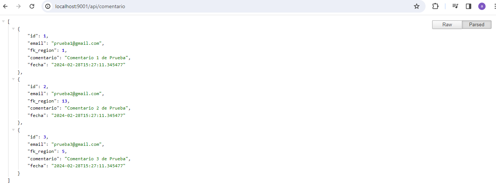
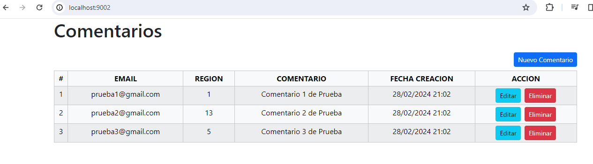
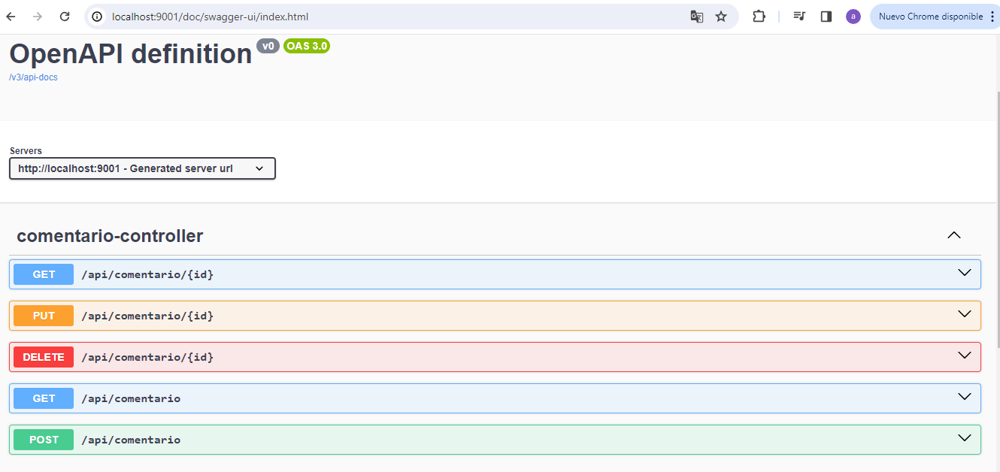

# Comentarios
Sistema para crear Comentarios utilizando Java Spring Boot en Backend  y Angular en Frontend.

## Java Spring Boot
Carpeta comentario-back [http://localhost:9001/]
El Backend está desarrollado en Java 17 con Spring Boot 3.2.3

- [ ] Java JDK 17 [https://www.oracle.com/cl/java/technologies/downloads/#java17]

Dependencias
- [ ] Spring Web
- [ ] Spring Data JPA
- [ ] H2 Database (in-memory)
- [ ] Lombok
- [ ] JUnit
- [ ] Mockito 5.10
- [ ] Springdoc 2.3 [https://springdoc.org/#Introduction] [http://localhost:9001/doc/swagger-ui/index.html]

## Angular
Carpeta comentario-front [http://localhost:9002/]
El Frontend está desarrollado en Angular 17.

Requisitos
- [ ] npm [https://docs.npmjs.com/cli/v10/commands/npm-install]
- [ ] NodeJS 20 (18.13+ Requerido) [https://nodejs.org/en/download/]
- [ ] Angular CLI [https://angular.io/cli]
- [ ] Bootstrap 5.1 [https://getbootstrap.com/docs/5.1/getting-started/download/]
- [ ] sweetalert2 [https://sweetalert2.github.io/#download]


## Clonar Repositorio
```
mkdir comentarios
cd comentarios
git clone https://gitlab.com/compuvalpo/comentarios.git
```

## Capturas


